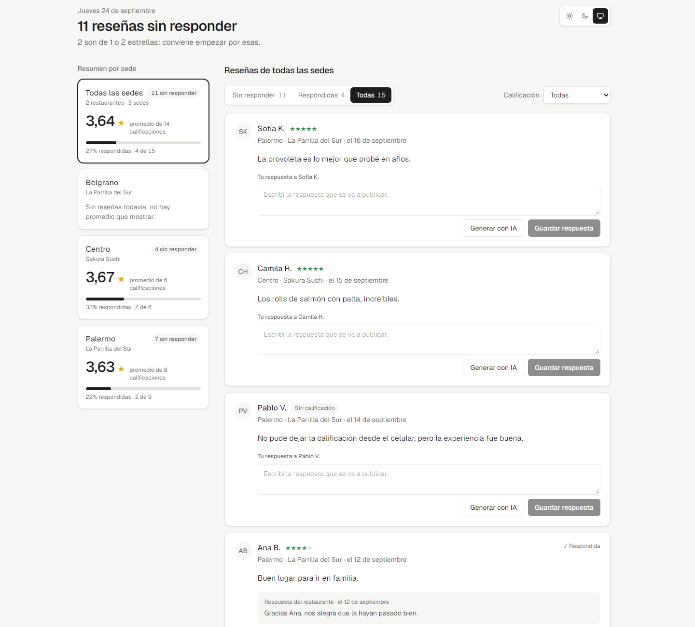
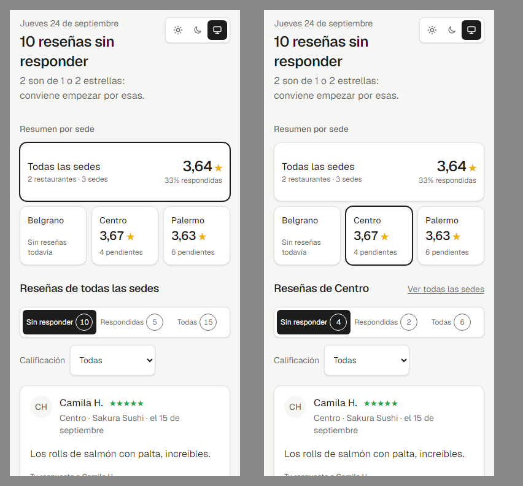
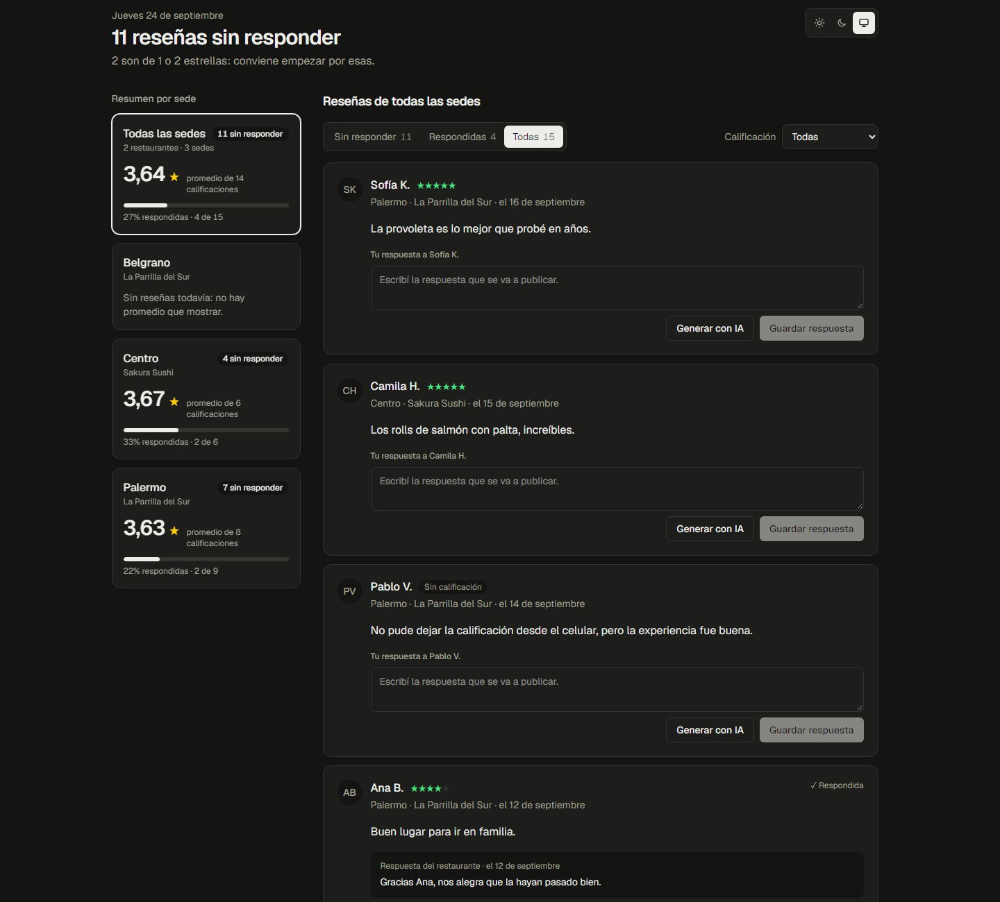
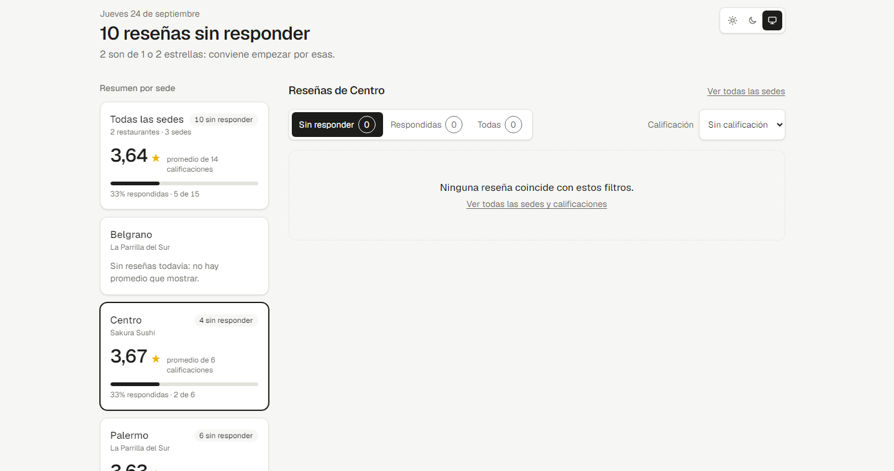

# Bandeja de reseñas

Una pantalla para el grupo gastronómico (dos restaurantes, tres sedes) que entra cada mañana a ver qué reseñas faltan contestar, pide un borrador a un modelo de lenguaje, lo ajusta y responde. Arriba se ve cuánto queda pendiente, al costado el resumen de cada sede y abajo la lista.

- **App publicada:** _pendiente, se completa después del deploy en Vercel_
- **Stack:** Next.js 16 (App Router) + TypeScript, Supabase (Postgres), Gemini para los borradores, Tailwind CSS 4, Vitest.



| Celular | Tema oscuro | Filtro sin resultados |
|---|---|---|
|  |  |  |

---

## Levantarlo desde cero

Requisitos: Node 22 o más nuevo y un proyecto de Supabase en el plan gratuito.

1. En Supabase, abrí **SQL Editor**, pegá [`supabase/schema.sql`](supabase/schema.sql) y dale a **Run**. Crea las tablas; se puede correr más de una vez.
2. Después:

```bash
npm install
cp .env.example .env.local   # completar los valores (ver abajo)
npm run import               # carga reviews.json en Supabase
npm run dev                  # http://localhost:3000
```

### Variables de entorno

Van en `.env.local`, que no se sube, y en Vercel (Project → Settings → Environment Variables). En [`.env.example`](.env.example) están los nombres, sin valores.

| Variable | Para qué | Dónde se consigue |
|---|---|---|
| `SUPABASE_URL` | Dirección del proyecto | Supabase → Project Settings → API → **Project URL**. Tiene que ser `https://<ref>.supabase.co`, **sin** `/rest/v1/`. |
| `SUPABASE_SERVICE_ROLE_KEY` | Leer y escribir desde el servidor | Supabase → Project Settings → API → **service_role**. Es secreta y nunca llega al navegador. |
| `GEMINI_API_KEY` | Generar borradores | [Google AI Studio](https://aistudio.google.com) → Get API key. Plan gratuito, sin tarjeta. |
| `GEMINI_MODEL` | Opcional. Cambia el modelo | Por defecto `gemini-3.6-flash`. |

Si falta alguna, la app lo dice en lugar de romperse:
- Sin las de Supabase, la pantalla explica qué variable falta y de dónde sale.
- Sin `GEMINI_API_KEY`, el botón pasa a decir **"IA no configurada"** y el resto funciona igual.

### Comandos

| Comando | Qué hace |
|---|---|
| `npm run dev` | Servidor de desarrollo |
| `npm test` | Corre los tests una vez (`npm run test:watch` para modo watch) |
| `npm run import` | Importa `reviews.json`. Se puede pasar otro archivo: `npm run import -- otro.json` |
| `npm run build` / `npm start` | Build y servidor de producción |
| `npm run lint` | ESLint |

---

## Qué hace

- **Importa** el JSON a Supabase con un script que se puede correr muchas veces sin duplicar nada.
- **Lista y filtra** por sede, calificación y estado (sin responder, respondidas, todas). Los filtros se combinan y quedan en la URL, así que un link se puede compartir.
- **Genera un borrador** con IA desde el servidor. Queda en el campo de respuesta, editable, y marcado como borrador que todavía no se guardó.
- **Guarda la respuesta**, sea el borrador ajustado o texto propio. Una reseña respondida muestra su respuesta y cuándo se respondió.
- **Resume cada sede**: total de reseñas, promedio de calificación y porcentaje respondido, más un total general.

---

## Decisiones sobre los datos

El archivo llega con varios problemas a propósito. Qué hace la app con cada uno:

| Caso | Decisión | Dónde está |
|---|---|---|
| **rv-205 aparece dos veces** (la segunda es una edición con otra calificación) | Queda la versión con `updated_at` más nuevo, sin importar el orden en el archivo. Rv-205 termina con 3★, no con 1★. El import avisa que la encontró duplicada. | `lib/import/plan.ts` |
| **rv-108 no tiene calificación** | Se importa con `rating = null` y se muestra "Sin calificación". **No entra en el promedio**, pero sí cuenta en el total de reseñas y en el % respondido, porque existe y hay que contestarla. | `lib/reviews/summary.ts` |
| **rv-301 apunta a `loc-99`, que no existe** | No se importa, y **la sede nunca se crea sola**. El import informa `rv-301: la sede loc-99 no existe`. Además, la foreign key de la base impediría insertarla. | `lib/import/plan.ts`, `supabase/schema.sql` |
| **Belgrano no tiene reseñas** | Su promedio y su % respondido son `null`, no 0. La pantalla dice "Sin reseñas todavía" en vez de mostrar un promedio de cero. | `lib/reviews/summary.ts`, `components/location-summaries.tsx` |
| **Reseñas que ya venían respondidas** (rv-103, rv-107, rv-201) | Entran con su respuesta y su `replied_at` original, y cuentan como respondidas igual que las contestadas desde la app. "Respondida" significa `reply_text` no nulo. | `lib/reviews/summary.ts` |
| **rv-105 tiene el texto vacío** (no estaba en la lista del enunciado) | Se importa igual y la tarjeta dice "Dejó la calificación sin comentario". El prompt le avisa al modelo que no invente detalles de la visita. | `components/review-card.tsx`, `lib/ai/draft-prompt.ts` |

**Con estos datos,** Palermo da **3,63** sobre 8 reseñas calificadas y Centro **3,67** con 6 reseñas, como indica el enunciado. Hay un test que lo verifica contra el `reviews.json` real.

### Importación idempotente

La lógica es una función pura, `planImport(archivo, lo que ya hay en la base)`, que decide qué crear, qué actualizar y qué saltear. El script después solo aplica ese plan. Las reglas:

- **Correrla dos veces deja la base igual.** La segunda corrida da `creadas 0 · actualizadas 0 · sin cambios 15`. Además, el `id` de la reseña es la clave primaria y el script hace upsert por ese id.
- **Un archivo más viejo no revierte una edición.** Si la base ya tiene un `updated_at` más nuevo, se queda con lo que tiene.
- **Si el archivo trae `reply: null`, no borra una respuesta guardada desde la app.** Entre dos respuestas, queda la de `replied_at` más reciente.
- **Las fechas se comparan como instantes, no como texto.** Postgres devuelve `+00:00` donde el archivo dice `Z`; si se comparara el texto, cada corrida marcaría todo como cambiado.
- **Cada reseña se valida por separado** con zod. Si una viene mal (por ejemplo, con `rating: 7`), se saltea con su motivo y no frena el resto.

Salida real contra la base:

```
Importado reviews.json
  creadas:      15
  actualizadas: 0
  sin cambios:  0
  salteadas:    1
    - rv-301: la sede loc-99 no existe
  rv-205 aparece más de una vez; quedó la versión con updated_at más nuevo
```

---

## Integración con los servicios

### Supabase

- **Tablas:** `restaurants`, `locations` y `reviews`. La respuesta vive en la misma fila de la reseña (`reply_text`, `replied_at`) porque cada reseña tiene como máximo una. Los checks de la base impiden que haya texto sin fecha, fecha sin texto o una respuesta vacía.
- **Ids en `text`:** son los mismos del archivo (`rv-101`, `loc-1`), así que la importación no necesita una columna aparte para no duplicar.
- **`updated_at` es la fecha de edición de Google, no la nuestra.** Guardar una respuesta no la toca; así el import puede seguir comparando contra el archivo.
- **RLS está activado sin políticas.** El navegador nunca habla con Supabase: todo pasa por el servidor con la `service_role`, y la llave `anon` no puede leer ni escribir nada.

### IA (Gemini)

- **La llamada sale solo del servidor**, en `POST /api/reviews/[id]/draft`. **El navegador manda solo el id de la reseña**: el servidor busca el texto, la calificación, el restaurante y la sede en la base. Así nadie puede usar la ruta para mandarle al modelo un texto propio. Revisé el bundle del navegador y el valor de la llave no aparece.
- **El prompt** (`lib/ai/draft-prompt.ts`) lleva el restaurante, la sede, el autor, la calificación y el texto. **El tono cambia según la calificación:**

  | Calificación | Tono |
  |---|---|
  | 1–2★ | Disculpas por el problema concreto, sin justificarse, y ofrecer seguir por privado |
  | 3★ | Agradecer y reconocer lo que no le gustó |
  | 4★ | Agradecer lo positivo y tomar nota de alguna sugerencia |
  | 5★ | Agradecer con entusiasmo nombrando un detalle e invitar a volver |
  | Sin calificación | Guiarse por lo que escribió |

  Reglas fijas del prompt:
  - Español rioplatense, dos o tres oraciones.
  - No inventar descuentos, teléfonos ni nombres, y no prometer compensaciones.
  - El texto de la reseña va delimitado y marcado como dato, para que el modelo no lo tome como instrucciones.
- **Modelo:** `gemini-3.6-flash`, con razonamiento mínimo porque un borrador de tres oraciones no lo necesita, y timeout de 30 s. `gemini-2.5-flash` ya no está disponible para llaves nuevas.
- **Errores con mensaje claro, nunca un 500:**

  | Caso | Código |
  |---|---|
  | Llave faltante | 503 |
  | Reseña inexistente | 404 |
  | Reseña ya respondida | 409 |
  | Modelo saturado (el free tier a veces devuelve 503) | 503 |
  | Tiempo agotado o respuesta vacía | 502 |

### Validación en las rutas

`POST /api/reviews/[id]/reply` valida el cuerpo con zod: texto requerido, sin contar los espacios, con un máximo de 2000 caracteres.

| Caso | Respuesta |
|---|---|
| Sin JSON | 400 `Mandá un JSON con la forma { "text": "..." }.` |
| Texto vacío | 400 `La respuesta no puede estar vacía.` |
| Reseña inexistente | 404 `No existe la reseña rv-999.` |
| Ya respondida | 409 `Esta reseña ya tiene una respuesta guardada.` |
| Falla de Supabase | 502, con un mensaje para reintentar |

El update solo escribe si la reseña **todavía no tiene respuesta** (`WHERE reply_text IS NULL`), así dos personas contestando a la vez no se pisan.

---

## La pantalla

- **Jerarquía.** Lo primero que se ve es cuánto queda pendiente y por dónde empezar, por ejemplo "**10 reseñas sin responder** · 2 son de 1 o 2 estrellas: conviene empezar por esas". La lista abre por defecto en **Sin responder**, que es lo que la persona busca a la mañana.
- **Resumen por sede.** En escritorio es una columna fija a la izquierda. En el celular son dos filas de la misma altura, "todas las sedes" y las tres sedes, con una versión compacta de los números y sin scroll horizontal. **Cada tarjeta funciona también como filtro de sede.**
- **Estados:**

  | Situación | Qué se ve |
  |---|---|
  | Carga | Un esqueleto con la misma forma que la pantalla final |
  | Filtro sin resultados | Mensaje con un link para quitar los filtros |
  | Sede sin reseñas | "Belgrano todavía no tiene reseñas." |
  | No queda nada pendiente | "No queda nada por responder." |
  | Falla al guardar | Mensaje bajo el campo, sin perder el texto |
  | Mientras genera el borrador | El botón dice "Generando…" y "Guardar" se deshabilita |
  | Error de la base | Pantalla con "Reintentar" |
  | Al guardar | Aviso "✓ Guardamos la respuesta a …" |

- **El borrador se nota como borrador:**
  - Aparece un aviso violeta, "✦ Borrador escrito por IA. Todavía no se guardó: revisalo antes de guardar", y el campo toma un borde punteado.
  - Si la persona lo edita, el aviso pasa a decir "Borrador de IA con tus cambios".
  - "Descartar borrador" vuelve a lo que había escrito antes de generar.
- **Color con significado, y poco:**
  - Solo la calificación lleva color: verde para 4 o más, amarillo desde 3, rojo por debajo de 3. Es la misma escala para las estrellas y los promedios (`lib/reviews/rating-tone.ts`).
  - El violeta se usa únicamente para el texto que escribió el modelo.
  - Todo lo demás es neutro.
- **Texto y fechas:**
  - Etiquetas cortas y en frase normal.
  - Las fechas se leen como las diría una persona ("ayer", "hace 4 días", "el 2 de septiembre"), según el calendario de Buenos Aires.
  - Los números usan formato argentino (3,63 · 27%) y cifras tabulares.
- **Tema claro, oscuro o según el sistema:**
  - Un script inline en el `<head>` aplica la preferencia guardada antes del primer pintado, así que no hay destello al entrar.
  - El cambio de tema tiene una transición suave, salvo que el sistema pida reducir el movimiento.
  - Los colores se definen una sola vez con `light-dark()`.
- **Filtrar no consulta la base.** El servidor manda todas las reseñas una vez y el filtrado ocurre en el navegador con las mismas funciones puras que tienen tests. La URL se actualiza con `history.replaceState`, que Next sincroniza con `useSearchParams` sin ir al servidor.

---

## Código

```
app/
  page.tsx                       carga los datos una vez (servidor)
  api/reviews/[id]/reply         guarda una respuesta
  api/reviews/[id]/draft         pide un borrador a la IA
components/                      UI: inbox, filtros, tarjetas, resumen, tema
lib/
  reviews/summary.ts             resumen por sede (función pura)
  reviews/filters.ts             filtros ↔ URL (función pura)
  reviews/rating-tone.ts         escala bueno / regular / malo
  reviews/repository.ts          lecturas y escrituras en Supabase
  import/plan.ts                 qué crear, actualizar o saltear (función pura)
  import/export-file.ts          validación del JSON
  ai/draft-prompt.ts             prompt según la calificación (función pura)
  ai/gemini.ts                   adaptador del proveedor de IA
scripts/import-reviews.ts        comando de importación
supabase/schema.sql              tablas, checks, índices y RLS
```

Cada parte está separada del resto. La lógica de negocio vive en funciones puras, sin acceso a la base ni a la red; `repository.ts` es lo único que habla con Supabase y `gemini.ts` lo único que habla con el modelo. Cambiar de proveedor de IA toca un solo archivo.

## Tests

`npm test` corre **43 tests** en 6 archivos. Prueban las reglas, no una foto de la salida actual:

- **Resumen:** una sede sin reseñas no tiene promedio ni %, una reseña sin calificación no entra en el promedio pero cuenta en el total, el caso normal, y el total de todas las sedes.
- **Con el `reviews.json` real:** Palermo 3,63 sobre 8 calificadas, Centro 6 reseñas y 3,67, Belgrano sin datos.
- **Importación:**
  - Idempotencia: la segunda corrida no escribe nada.
  - Duplicado resuelto por `updated_at`, sin importar el orden.
  - Un archivo viejo no revierte, y `reply: null` no borra respuestas.
  - Sede inexistente salteada y nunca creada.
  - Una fila inválida se reporta sin frenar el resto.
- **Filtros:** la lectura desde la URL, la ida y vuelta con el query string, la combinación de filtros y los valores inválidos.
- **Prompt:** lleva restaurante, calificación y texto; 1★ pide disculpas y 5★ no; sin calificación; sin texto; la reseña va separada de las instrucciones.
- **Formato de fechas y números**, en el calendario de Buenos Aires.

---

## Límites conocidos y qué quedó afuera

- **Todas las reseñas viajan al navegador.** Para tres sedes son pocas y permite filtrar al instante. Si fueran miles, filtraría y paginaría en la base con `range()`.
- **La importación no corre en una transacción.** Si se corta a mitad de camino, volver a correr `npm run import` completa lo que falta, porque cada paso es idempotente. Para hacerlo atómico usaría una función de Postgres llamada por RPC.
- **El free tier de Gemini a veces se satura.** En las pruebas, algunos pedidos tardaron más de 30 s o devolvieron 503. La app lo informa y se puede responder a mano. Como el proveedor está aislado en `lib/ai/gemini.ts`, sumar Groq como alternativa automática sería el siguiente paso.
- **Una respuesta guardada no se puede editar.** La ruta devuelve 409 a propósito para no pisar respuestas; editar necesitaría una acción explícita.
- **No hay autenticación.** El enunciado no la evalúa. Con usuarios, la `anon` key y RLS por usuario reemplazarían el acceso con `service_role`.
- **No elegí bonus todavía.** El candidato es el orden por urgencia: 1–2★ sin responder arriba, las más viejas primero.
